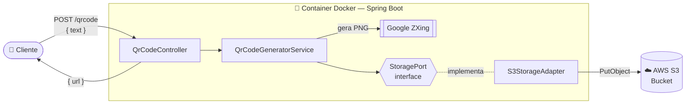

<h1 align="center">📱 QR Code Generator</h1>

<p align="center">
  API REST que gera QR Codes a partir de um texto e armazena as imagens na <b>AWS S3</b>, retornando a URL pública do arquivo.
</p>

<p align="center">
  
  
  
  
  
</p>

---

## 📋 Sumário

- [Sobre o projeto](#-sobre-o-projeto)
- [Funcionalidades](#-funcionalidades)
- [Tecnologias](#-tecnologias)
- [Arquitetura](#-arquitetura)
- [Estrutura de pastas](#-estrutura-de-pastas)
- [Como executar](#-como-executar)
- [Uso da API](#-uso-da-api)
- [Autor](#-autor)

---

## 💡 Sobre o projeto

O **QR Code Generator** é uma API construída com **Spring Boot** que recebe um texto (uma URL, uma mensagem, um contato…), transforma esse conteúdo em uma imagem PNG de QR Code usando a biblioteca **ZXing** do Google e faz o upload da imagem para um bucket na **Amazon S3**. Como resposta, o cliente recebe a URL onde o QR Code ficou disponível.

A aplicação é empacotada em uma imagem **Docker** com *multi-stage build*, pronta para rodar em qualquer ambiente.

## ✨ Funcionalidades

- ✅ Geração de QR Code (200x200 px, formato PNG) a partir de qualquer texto
- ☁️ Upload automático da imagem para um bucket **AWS S3**
- 🔗 Retorno da URL do arquivo gerado
- 🆔 Nome único para cada arquivo usando `UUID`
- 🧩 Arquitetura hexagonal (Ports & Adapters), desacoplando a regra de negócio do provedor de armazenamento
- 🐳 Containerização com Docker (*multi-stage build*)
- 🔐 Configuração via variáveis de ambiente (credenciais nunca ficam no código)

## 🛠 Tecnologias

| Tecnologia | Uso no projeto |
|---|---|
| **Java 21** | Linguagem principal (uso de `records` para DTOs) |
| **Spring Boot 4 (Web MVC)** | Criação da API REST e injeção de dependências |
| **Google ZXing** | Geração da matriz do QR Code e conversão para PNG |
| **AWS SDK for Java v2 (S3)** | Upload das imagens para o bucket S3 |
| **Docker** | Build e execução da aplicação em container |
| **Maven** | Gerenciamento de dependências e build |

## 🏛 Arquitetura

O projeto segue a **Arquitetura Hexagonal (Ports & Adapters)**. A camada de serviço depende apenas de uma **interface** (`StoragePort`), e não da AWS diretamente. A implementação concreta (`S3StorageAdapter`) fica na camada de infraestrutura.

Isso significa que, se amanhã for necessário trocar o S3 por outro provedor (Google Cloud Storage, Azure Blob, disco local…), basta criar um novo *adapter* — **sem alterar nenhuma linha da regra de negócio**.



### Fluxo de uma requisição

1. O cliente envia um `POST /qrcode` com o texto desejado.
2. O **`QrCodeController`** recebe a requisição e delega ao serviço.
3. O **`QrCodeGeneratorService`** usa o ZXing para gerar a `BitMatrix` e convertê-la em bytes PNG.
4. O serviço chama a **`StoragePort`**, sem saber qual armazenamento está por trás.
5. O **`S3StorageAdapter`** envia o arquivo ao bucket S3 com um nome `UUID` e `content-type: image/png`.
6. A URL do arquivo é devolvida ao cliente.

### Camadas

| Camada | Classe | Responsabilidade |
|---|---|---|
| **Controller** | `QrCodeController` | Expor o endpoint REST e tratar a resposta HTTP |
| **DTO** | `QrCodeGenerateRequest` / `QrCodeGenerateResponse` | Contratos de entrada e saída (Java `records`) |
| **Service** | `QrCodeGeneratorService` | Regra de negócio: gerar o QR Code e solicitar o armazenamento |
| **Port** | `StoragePort` | Interface que define o contrato de armazenamento |
| **Infrastructure** | `S3StorageAdapter` | Implementação do armazenamento usando AWS S3 |

## 📁 Estrutura de pastas

```
qrcode-generator/
├── Dockerfile
├── pom.xml
└── src/main/
    ├── java/com/caioscura/qrcode/generator/
    │   ├── Application.java
    │   ├── controller/
    │   │   └── QrCodeController.java
    │   ├── dto/qrcode/
    │   │   ├── QrCodeGenerateRequest.java
    │   │   └── QrCodeGenerateResponse.java
    │   ├── service/
    │   │   └── QrCodeGeneratorService.java
    │   ├── ports/
    │   │   └── StoragePort.java
    │   └── infrastructure/
    │       └── S3StorageAdapter.java
    └── resources/
        └── application.properties
```

## 🚀 Como executar

### Pré-requisitos

- Conta na **AWS** com um bucket S3 criado
- Um usuário IAM com permissão `s3:PutObject` no bucket (Access Key + Secret Key)
- **Docker** instalado (ou Java 21 + Maven para rodar localmente)

### Variáveis de ambiente

| Variável | Descrição | Exemplo |
|---|---|---|
| `AWS_ACCESS_KEY_ID` | Access key do usuário IAM | `AKIA...` |
| `AWS_SECRET_ACCESS_KEY` | Secret key do usuário IAM | `********` |
| `AWS_REGION` | Região do bucket | `us-east-1` |
| `AWS_BUCKET_NAME` | Nome do bucket S3 | `qrcode-generator-name` |

Crie um arquivo `.env` na raiz do projeto (ele já está no `.gitignore`):

```env
AWS_ACCESS_KEY_ID=sua-access-key
AWS_SECRET_ACCESS_KEY=sua-secret-key
AWS_REGION=us-east-1
AWS_BUCKET_NAME=nome-do-seu-bucket
```

### 🐳 Rodando com Docker

O `Dockerfile` utiliza **multi-stage build**:

- **Stage 1 (build):** imagem `maven:3.9.5-eclipse-temurin-21-alpine` compila o projeto e gera o `.jar`.
- **Stage 2 (runtime):** imagem enxuta `eclipse-temurin:21-jre-alpine` contendo apenas o JRE e o `.jar` final.

```bash
# 1. Build da imagem
docker build -t qrcode-generator .

# 2. Executar o container passando as variáveis de ambiente
docker run -p 8080:8080 --env-file .env qrcode-generator
```

### ☕ Rodando localmente (sem Docker)

```bash
# Linux / macOS
export $(cat .env | xargs)
./mvnw spring-boot:run
```

```powershell
# Windows (PowerShell)
Get-Content .env | ForEach-Object { $k, $v = $_ -split '=', 2; Set-Item "env:$k" $v }
.\mvnw.cmd spring-boot:run
```

A API ficará disponível em `http://localhost:8080`.

## 📡 Uso da API

### `POST /qrcode`

Gera um QR Code a partir do texto informado e retorna a URL da imagem no S3.

**Request**

```bash
curl -X POST http://localhost:8080/qrcode \
  -H "Content-Type: application/json" \
  -d '{ "text": "https://github.com/CaioScura" }'
```

```json
{
  "text": "https://github.com/CaioScura"
}
```

**Response — `200 OK`**

```json
{
  "url": "https://nome-do-seu-bucket.s3.us-east-1.amazonaws.com/3f1c2a9e-7b4d-4c8e-9a1f-2d6e5b8c0a7f"
}
```

**Response — `500 Internal Server Error`**

Retornado quando ocorre falha na geração do QR Code ou no upload para o S3.

## 👨‍💻 Autor

Feito por **Caio Scura**.

[](https://github.com/CaioScura)
